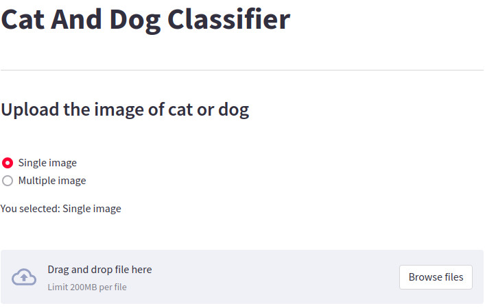

# Cat and Dog Classifier
This GitHub repository contains a simple Cat and Dog Classifier project built using TensorFlow/Keras and Streamlit. The project includes three Python files: app.py, predict.py, and camera.py, which together provide a user-friendly web application for image classification.

## Overview
The Cat and Dog Classifier is a deep learning model capable of distinguishing between images of cats and dogs. It utilizes a pre-trained deep learning model and allows users to either upload a single image or multiple images for classification. Additionally, the repository includes a script for real-time image classification using a webcam.

## Files
app.py:

This file contains the source code for the web application. It utilizes Streamlit, a powerful Python library for building interactive web applications, to create a user interface. Users can upload images of cats or dogs, and the application will display the predicted class along with the uploaded image.

predict.py:

The predict.py script demonstrates how to perform image classification using the pre-trained model. It reads an example image (05.jpeg), preprocesses it, and then makes predictions using the deep learning model. The predicted class and confidence score are printed to the console.

camera.py:

The camera.py script enables real-time image classification using a webcam. It captures frames from the default camera (camera index 0) and feeds them into the model for classification. The predicted class and confidence score are displayed on the screen in real-time.

## Dependencies
To run the Cat and Dog Classifier, ensure you have the following dependencies installed:

- TensorFlow
- Keras
- OpenCV (opencv-python)
- Pillow
- Streamlit

You can install the required packages using the provided requirements.txt file.

## Usage
Clone the repository:
```
git clone https://github.com/Xphi310302/dog-cat-classifier_xphi.git
cd dog-cat-classifier_xphi
```

Install the dependencies:
```
pip install -r requirements.txt
```
Run the web application:
```
streamlit run app.py
```
I also deploy the classifier on cloud, you can test the model on: [Cat&Dog-classifier](https://dog-cat-classifierxphi-awmvjaidgr.streamlit.app/). In case the web is sleeping, it need to reconnect. Please contact me via 0945940064 or xphi.work@gmail.com if the website doesn't work. You can test the web locally by running the command "streamlit run app.py"



## If you want to test the model without web application. following these instruction
Example Image:

The script uses 05.jpeg as an example image for classification. Replace it with your image or modify the script to accept an image path.

Run the Script:

To classify the example image, run the following command:
```
python predict.py
```
The script will display the predicted class and confidence score.

Customization:

Replace 05.jpeg with your image to classify a different image.

Follow the instructions in the web application to upload single or multiple images for classification. Alternatively, use the predict.py script to classify an example image or camera.py for real-time webcam classification.
Enjoy classifying your cat and dog images with ease using this interactive web application and provided scripts!

